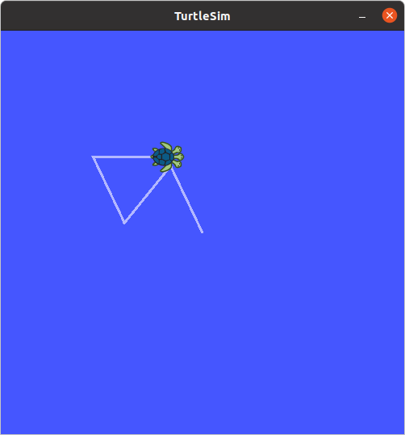
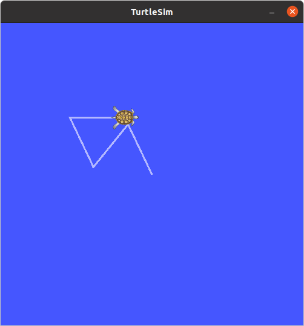

# Day 3 실습 결과

# 실습 1: 거북이 움직임 기록 및 재생

## rosbag record



### 기록 내용 확인

```bash
$ rosbag info my_turtle.bag
```
```
path:        my_turtle.bag
version:     2.0
duration:    18.2s
start:       Mar 04 2026 23:32:17.12 (1772695937.12)
end:         Mar 04 2026 23:32:35.35 (1772695955.35)
size:        94.1 KB
messages:    1148
compression: none [1/1 chunks]
types:       geometry_msgs/Twist [9f195f881246fdfa2798d1d3eebca84a]
             turtlesim/Pose      [863b248d5016ca62ea2e895ae5265cf9]
topics:      /turtle1/cmd_vel      8 msgs    : geometry_msgs/Twist
             /turtle1/pose      1140 msgs    : turtlesim/Pose
```
확인할 것:

duration이 몇 초인가요?         
- 18.2초

어떤 토픽이 기록되었나요?
- /turtle1/cmd_vel, /turtle1/pose

각 토픽의 메시지 수는 몇 개인가요? 
- 8, 1140


## rosbag play



### 재생
```bash
rosbag play my_turtle.bag
```
### 2배속으로 재생
```bash
rosbag play my_turtle.bag -r 2
```
### 무한 반복 재생
```bash
rosbag play my_turtle.bag -l
```


# 실습 2: 재생 데이터를 Subscriber로 수신

rosbag play가 발행하는 데이터를 Day 2에서 만든 Subscriber 패턴으로 받아봅니다.


## 1단계: 토픽 메시지 타입 확인
Day 2에서 만든 Subscriber는 /counter 토픽(Int32)을 수신했습니다. 이번에는 거북이 위치 토픽을 수신하는 Subscriber를 만듭니다.
```bash
rostopic type /turtle1/pose
```
```
turtlesim/Pose
```
```bash
rosmsg show turtlesim/Pose
```
```
float32 x
float32 y
float32 theta
float32 linear_velocity
float32 angular_velocity
```
## 2단계: pose_listener.py 작성

[pose_listner.py](beginner_tutorials/scripts/pose_listener.py)

## 3단계: rosbag play + Subscriber 연동

[ ] rosbag play가 시작되면 Subscriber에 위치 데이터가 출력되나요?
- 시작되기 전부터 출력됨

[ ] rosbag play가 끝나면 Subscriber도 데이터 수신이 멈추나요?
- 데이터 수신이 계속됨


# 실습 3: 선택적 기록과 필터링 (도전)

## 1단계: 전체 기록 vs 선택 기록
turtlesim + teleop이 실행 중인 상태에서 두 가지 방식으로 기록합니다:

### 방법 A: 모든 토픽 기록

```
ubuntu20@ubuntu:~/catkin_ws/src/bagfiles$ rosbag record -a -O all_topics.bag --duration=10

[INFO] [1772698807.895801327]: Recording to 'all_topics.bag'.
[INFO] [1772698807.897365803]: Subscribing to /rosout_agg
[INFO] [1772698807.899636439]: Subscribing to /rosout
[INFO] [1772698807.901929610]: Subscribing to /turtle1/pose
[INFO] [1772698807.904054248]: Subscribing to /turtle1/color_sensor
Error in XmlRpcClient::writeRequest: write error (Connection refused).
Error in XmlRpcClient::writeRequest: write error (Connection refused).
Error in XmlRpcClient::writeRequest: write error (Connection refused).

ubuntu20@ubuntu:~/catkin_ws/src/bagfiles$ ls

all_topics.bag  my_turtle.bag

ubuntu20@ubuntu:~/catkin_ws/src/bagfiles$ rosbag info all_topics.bag 

path:        all_topics.bag
version:     2.0
duration:    10.0s
start:       Mar 05 2026 00:27:20.63 (1772699240.63)
end:         Mar 05 2026 00:27:30.61 (1772699250.61)
size:        94.3 KB
messages:    1234
compression: none [1/1 chunks]
types:       geometry_msgs/Twist [9f195f881246fdfa2798d1d3eebca84a]
             rosgraph_msgs/Log   [acffd30cd6b6de30f120938c17c593fb]
             turtlesim/Color     [353891e354491c51aabe32df673fb446]
             turtlesim/Pose      [863b248d5016ca62ea2e895ae5265cf9]
topics:      /rosout                   3 msgs    : rosgraph_msgs/Log  
             /turtle1/cmd_vel          9 msgs    : geometry_msgs/Twist
             /turtle1/color_sensor   611 msgs    : turtlesim/Color    
             /turtle1/pose           611 msgs    : turtlesim/Pose

```

### 방법 B: cmd_vel만 기록

```
ubuntu20@ubuntu:~/catkin_ws/src/bagfiles$ rosbag record /turtle1/cmd_vel -O cmd_only --duration=10

[INFO] [1772698962.539783414]: Subscribing to /turtle1/cmd_vel
[INFO] [1772698962.543546342]: Recording to 'cmd_only.bag'.

ubuntu20@ubuntu:~/catkin_ws/src/bagfiles$ ls

all_topics.bag  cmd_only.bag  my_turtle.bag

ubuntu20@ubuntu:~/catkin_ws/src/bagfiles$ rosbag info cmd_only.bag 

path:        cmd_only.bag
version:     2.0
duration:    8.9s
start:       Mar 05 2026 00:26:08.01 (1772699168.01)
end:         Mar 05 2026 00:26:16.94 (1772699176.94)
size:        7.3 KB
messages:    14
compression: none [1/1 chunks]
types:       geometry_msgs/Twist [9f195f881246fdfa2798d1d3eebca84a]
topics:      /turtle1/cmd_vel   14 msgs    : geometry_msgs/Twist

```

## 2단계: 두 파일 비교

| 항목 | all_topics.bag | cmd_only.bag |
|:---:|:---:|:---:|
| 토픽 수 | 4 | 1 |
| 메시지 수 | 1234 | 14 |
| 파일 크기 | 94.3KB | 7.3KB |

## 3단계: cmd_vel만 기록한 파일로 재생

### turtlesim 재시작 후
```bash
rosbag play cmd_only.bag
```

- [x] 거북이가 움직이나요?

- [x] rostopic echo /turtle1/pose를 실행하면 데이터가 나오나요?

### 체크리스트

- [x] rosbag record -O로 파일 이름을 지정하여 기록했나요?

- [x] rosbag info로 기록 시간, 토픽, 메시지 수를 확인했나요?

- [x] rosbag play로 재생 시 거북이가 같은 경로로 움직이나요?

- [x] -r 옵션으로 배속 재생이 되나요?

- [x] -l 옵션으로 반복 재생이 되나요?

- [x] 스크린샷을 day03.md에 마크다운 이미지로 첨부했나요?

- [x] rosbag play 중 Subscriber가 데이터를 수신하나요?

- [x] (도전) 전체 기록과 선택 기록의 파일 크기 차이를 확인했나요?
